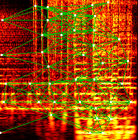

# Ithaca

OCaml implementation of a scalable audio fingerprinting method with robustness to pitch-shifting.

## References

- [A Scalable Audio Fingerprint Method with Robustness to Pitch-Shifting](reference/Ismir'11.pdf) (S. Fenet et al., ISMIR 2011) — fingerprinting algorithm

## Visualization

The `visualize` tool (optional, requires `imagelib`) renders a CQT spectrogram of a WAV file with detected peaks (white dots) and hash pairs (green lines) overlaid:

```
dune exec bin/optionals/visualize.exe -- input.wav output.png
```



## Prerequisites

* [OCaml](https://ocaml.org/) and [opam](https://opam.ocaml.org/)
* [LMDB](https://dbdb.io/db/lmdb) system library

On macOS:
```
brew install opam lmdb
```

On Debian/Ubuntu:
```
apt install liblmdb-dev
```

## Build instructions

```
opam install . --deps-only
dune build
```

## Development wrappers

The repository includes shell wrappers that build and run binaries in one step via `dune exec`:

```
./ithaca -mode search -lmdb-path fp.db -i sample.wav
./integration-index --audio-dir ~/music --db ~/fp.db
./integration-test  --audio-dir ~/music --db ~/fp.db
```

Each wrapper rebuilds automatically if the source has changed.

## Binaries

* **ithaca** — fingerprint indexer and searcher
* **ithaca_distributed** — distributed workflow: slicing, hashing, searching and consolidation
* **ithaca_json_store** — rebuild a fingerprint database from JSON hash files
* **fcqt_shift** — pitch-shift a WAV file by a given number of semitones via CQT bin shifting

## Local operations

### Hashing

```
% ithaca -mode store -lmdb-path /path/to/fingerprint.db -i /path/to/1234.wav -id 1234
ithaca -- Audio Fingerprinting in exile
Storing: 1234.wav
WAVE PCM Data 2ch, 44100Hz 16bit, duration: 00:02:30
Storing at ID: 1234
Position: 00:02:29, generated 4632 hashes
Processing time: 00:00:06 (24.7x realtime)
```

### Searching

```
% ithaca -mode search -lmdb-path /path/to/fingerprint.db -i /path/to/sample.wav
ithaca -- Audio Fingerprinting in exile
Reading hashing profile from /path/to/fingerprint.db..
Search for matches in sample.wav
WAVE PCM Data 2ch, 44100Hz 16bit, duration: 00:00:50
Position: 00:00:49, generated 2485 hashes
Processing time: 00:00:02 (20.5x realtime)
Found match: 0.00 -> 50.00: ID 1234
Found match: 0.00 -> 50.00: ID 5678 (pitch: +2.0 semitones)
```

Search results include a `pitch_semitones` field (also in JSON output) indicating the pitch offset of the query relative to the indexed audio. A value of `+2.0` means the query audio is pitched up by 2 semitones compared to what was indexed.

## Integration tests

The integration tests measure end-to-end identification accuracy against a real audio library. They require `ffmpeg` and the `pitch_shift` binary (built automatically, requires `soundtouch`) in `PATH`.

### Indexing

Build a fingerprint database from a directory of audio files. Files longer than 20 minutes are skipped. Indexing runs in parallel across all available CPU cores.

```
./integration-index --audio-dir /path/to/music --db /path/to/fp.db
```

Options:
- `--ithaca PATH` — path to the `ithaca` binary (default: built binary)
- `--max-duration SECS` — skip files longer than this (default: 1200)
- `--max-files N` — index at most N files (default: no limit; useful for quick experiments)
- `--b1-divisor D` — hash granularity: `b̂₁ = ⌊b1/D⌋`. Larger D gives more pitch-shift tolerance at the cost of more hash collisions (default: ithaca's default, currently 6)
- `--reassign` — enable frequency reassignment for sharper peak positions (~6× slower)
- `--jobs N` — parallel workers (default: number of CPU cores)

This produces `fp.db` (LMDB database) and `fp.db.manifest` (list of indexed files). The manifest is required by the test command.

### Running tests

Draw a random sample of indexed files, extract short clips, and search for them in the database:

```
./integration-test --audio-dir /path/to/music --db /path/to/fp.db
```

Options:
- `--samples N` — number of files to sample (default: 50)
- `--clips N` — clips per file (default: 3)
- `--clip-duration SECS` — clip length in seconds (default: 20)
- `--no-pitch` — skip pitch-shift identification tests (default: ±0.5 and ±1.0 semitones via soundtouch)
- `--sfx-dir DIR` — mix a random sound effect from this directory into each clip before searching
- `--sfx-mono BOOL` — convert SFX to mono before mixing (default: false)
- `--sfx-source-lufs LUFS` — target loudness for the source audio (default: -14)
- `--sfx-mixed-lufs LUFS` — target loudness for the SFX (default: -10)
- `--samples-dir DIR` — save prepared clip samples here for manual inspection (default: temporary directory, cleaned up on exit)
- `--threshold RATE` — minimum identification rate to pass, 0.0–1.0 (default: 0.80)
- `--jobs N` — parallel workers (default: number of CPU cores)

When `--sfx-dir` is provided, each clip is also tested with a random SFX mixed in and the SFX identification rate is reported separately.

## Distributed operations

### Hashing

Generate JSON hashes (one per track, parallelisable):

```
% ithaca -mode store -output json -i /path/to/1234.wav -id 1234 > /tmp/1234.json
```

Build fingerprint DB from collected JSON files:

```
% ithaca_json_store -lmdb-path /path/to/fingerprint.db -d /path/to/json/hashes
```

### Searching

Extract slices to distribute:

```
% ithaca_distributed -mode enqueue -i /path/to/sample.wav 2>/dev/null
{"header":{"channels":2,...},"slices":[{"offset":0.0,"start":140,"length":10584000},...]}
```

Search one slice (parallelisable):

```
% ithaca_distributed -mode search -offset 0.0 \
    -header '{"channels":2,"sample_rate":44100,...}' \
    -i /path/to/slice.raw -lmdb-path /path/to/fingerprint.db 2>/dev/null
[{"start":0.0,"stop":59.15,"id":"1234"}]
```

Consolidate results:

```
% ithaca_distributed -mode finalize \
    -matches '[{"start":0.0,"stop":59.15,"id":"1234"},{"start":50.0,"stop":87.23,"id":"1234"}]' \
    2>/dev/null
[{"start":0.0,"stop":87.23,"id":"1234"}]
```
